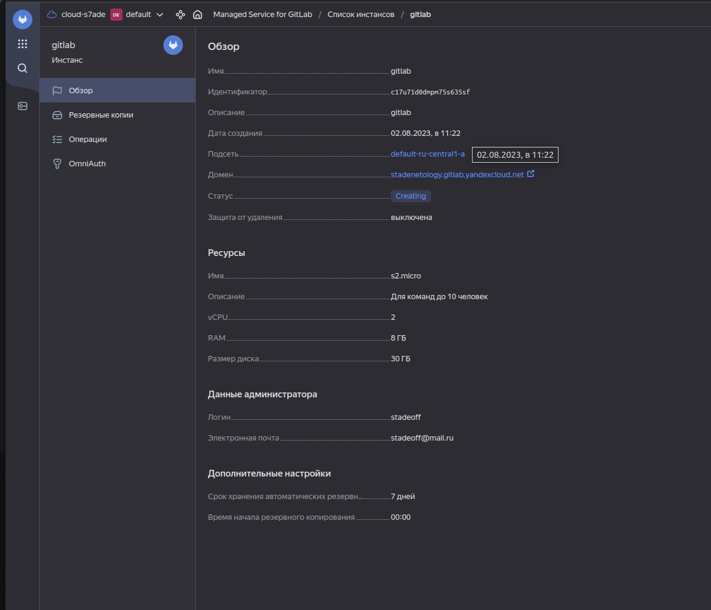
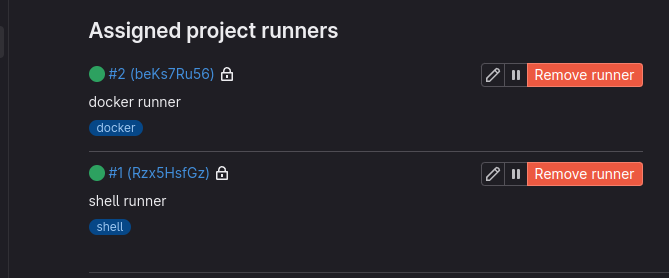
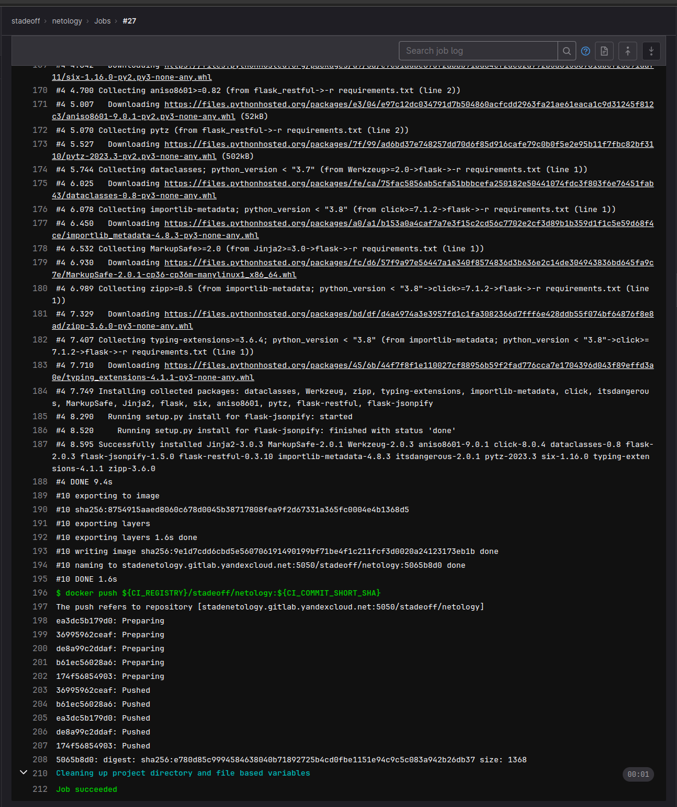
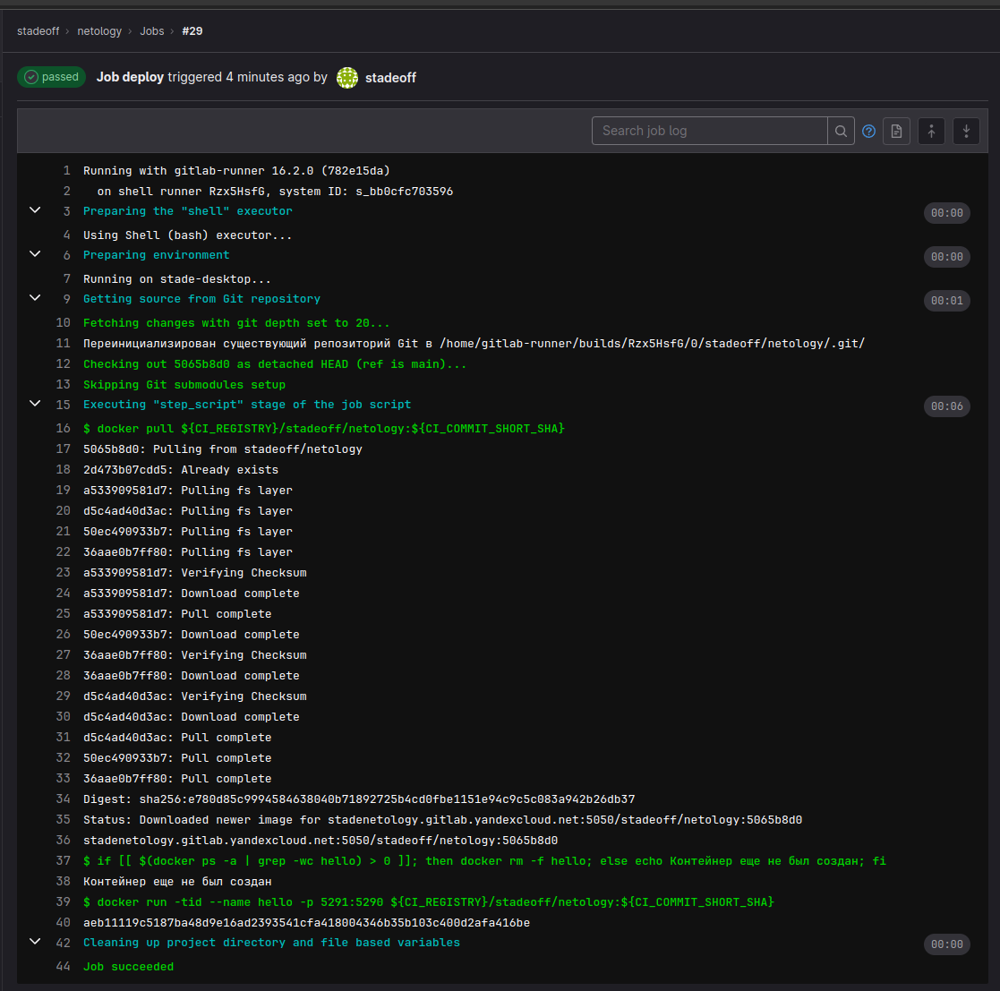
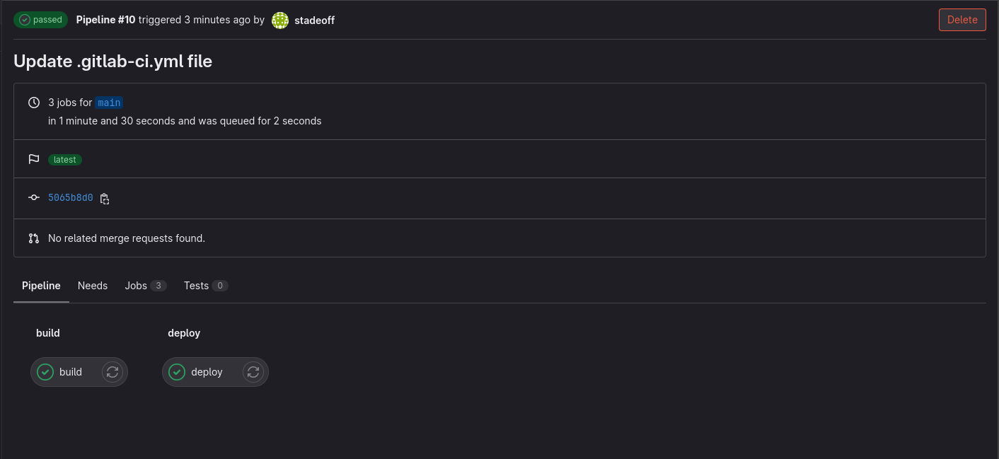
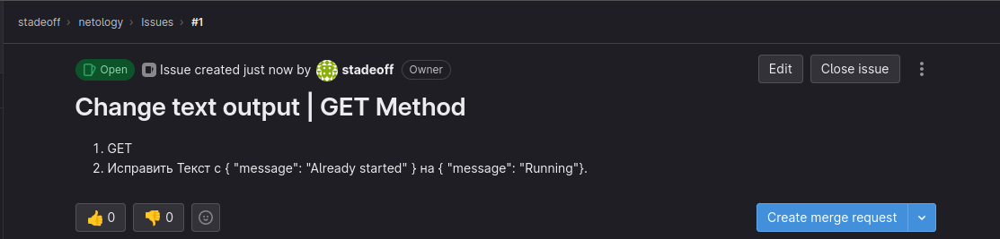
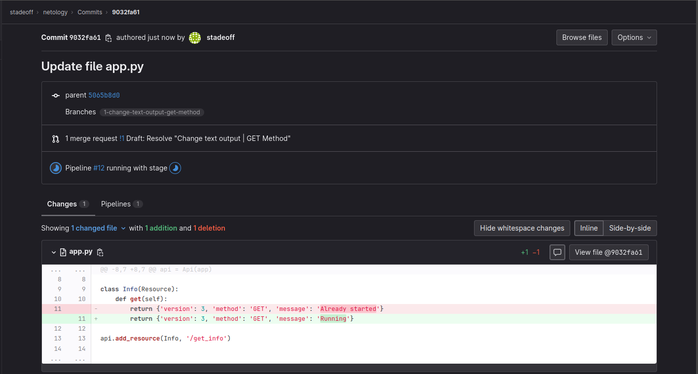
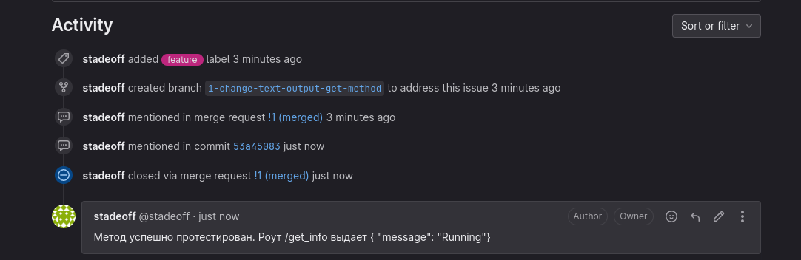

# Домашнее задание к занятию 12 «GitLab»

## Подготовка к выполнению
Instance 



Runners (Создал 2 раннера с executor docker, shell)


## Основная часть

### DevOps


**Dockerfile**
```Docker
FROM centos:7

WORKDIR /python_api

RUN yum install python3 python3-pip -y

COPY . .

RUN pip3 install -r requirements.txt

ENTRYPOINT ["python3", "app.py"]

```
**.gitlab-ci.yml**
```yml
stages:
  - build
  - deploy

build:
  stage: build
  image: docker:20.10
  variables:
    DOCKER_HOST: tcp://docker:2375/
    DOCKER_DRIVER: overlay2
    DOCKER_TLS_CERTDIR: ""
  tags:
    - docker
  services:
    - docker:dind
  before_script:
    - docker login -u ${CI_REGISTRY_USER} -p ${TOKEN} ${CI_REGISTRY}
  script:
    - docker build -t ${CI_REGISTRY}/stadeoff/netology:${CI_COMMIT_SHORT_SHA} .
    - docker push ${CI_REGISTRY}/stadeoff/netology:${CI_COMMIT_SHORT_SHA}

deploy:
  stage: deploy
  tags:
    - shell
  only: 
    - main
  script:
  - docker pull ${CI_REGISTRY}/stadeoff/netology:${CI_COMMIT_SHORT_SHA}
  - if [[ $(docker ps -a | grep -wc hello) > 0 ]]; then docker rm -f hello; else echo Контейнер еще не был создан; fi
  - docker run -tid --name hello -p 5291:5290 ${CI_REGISTRY}/stadeoff/netology:${CI_COMMIT_SHORT_SHA} 
```








### Product Owner



### Developer




### Tester




